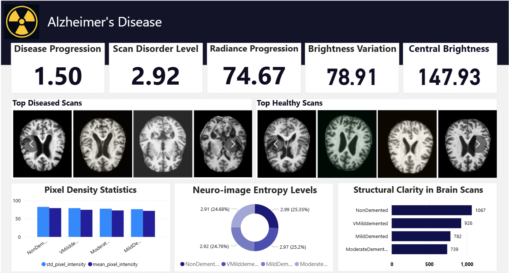

# 🧠 Alzheimer’s Disease Detection Dashboard  

## 📌 Project Overview  
This project focuses on building an **interactive dashboard** to analyze brain MRI scans for detecting Alzheimer’s disease progression. The dashboard provides statistical and visual insights into **healthy vs. diseased scans** using multiple image processing techniques.  

The goal is to present **clear, data-driven indicators** that highlight differences in brain structure across stages of dementia.  

---

## 🚀 Dashboard Features  

### Key Indicators  
- **Disease Progression** – Numerical score indicating overall disease severity.  
- **Scan Disorder Level** – Measures irregularities in brain scan structures.  
- **Radiance Progression** – Tracks changes in radiance across brain scans.  
- **Brightness Variation** – Detects pixel intensity variations.  
- **Central Brightness** – Focuses on intensity in central brain regions.  

### Visual Sections  
- **Top Diseased Scans** – MRI images showing strong dementia patterns.  
- **Top Healthy Scans** – MRI images with no dementia patterns.  

### Analytical Charts  
- **Pixel Density Statistics** – Mean & standard deviation of pixel intensities across dementia categories.  
- **Neuro-image Entropy Levels** – Entropy scores representing randomness/disorder in brain scans.  
- **Structural Clarity in Brain Scans** – Comparison of structural clarity for:  
  - NonDemented  
  - VeryMildDemented  
  - MildDemented  
  - ModerateDemented  

---

## 📊 Dataset  
The dataset used is the **OASIS (Open Access Series of Imaging Studies)** dataset. It contains brain MRI images classified into:  

- **NonDemented**  
- **VeryMildDemented**  
- **MildDemented**  
- **ModerateDemented**  

This dataset provides labeled scans for developing and testing statistical/visual analysis.  

---

## 📷 Dashboard Preview

## 🔍 Insights from the Dashboard

* Diseased scans show **higher disorder levels and entropy** compared to healthy scans.
* **Central brightness** and **pixel density variations** provide useful separation between healthy and demented scans.
* Structural clarity **decreases** as dementia severity progresses.

--

---

